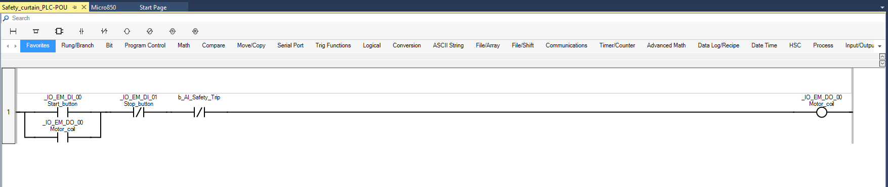

# AI-Powered Safety Curtain Integration with Micro850 PLC

## Project Overview
This project demonstrates a modernized approach to industrial safety by integrating computer vision with a Rockwell Automation Micro850 PLC. It serves as a proof-of-concept for replacing or augmenting expensive physical light curtains with a software-defined vision system.

## Usage Scenario
In traditional manufacturing environments, "Light Curtains" (infrared safety beams) are used to detect when a human operator reaches into a dangerous machine area, triggering an emergency stop. These hardware components are expensive, rigid in installation, and difficult to modify.

**This solution addresses that by:**
1.  Using a standard camera to monitor a user-defined "Safety Zone."
2.  Utilizing Python (Computer Vision) to detect intrusion (e.g., a hand or person).
3.  Communicating directly with the Industrial Controller (PLC) over EtherNet/IP.
4.  Triggering a millisecond-latency safety stop in the PLC logic to cut power to the motor.

## System Architecture
* **Vision System:** Python script capturing video feed and processing frames for intrusion detection.
* **Communication:** `pycomm3` library establishes an explicit EtherNet/IP session with the PLC.
* **Control System:** Rockwell Micro850 (Simulated via Micro800 Simulator) executing Ladder Logic to manage the safety interlock and motor output.

## Demonstration
Below is a video recording of the system in action. The Python script detects the intrusion, sends the trip signal, and the PLC immediately de-energizes the coil.

https://github.com/user-attachments/assets/388c0f12-3a45-47fa-86c9-88cd3e3c0caa

## PLC Logic
The control logic is implemented in Connected Components Workbench (CCW). It features a "Safety Seal-in" circuit where the `b_AI_Safety_Trip` tag acts as a normally closed (NC) break contact.

## Technical Stack
* **Hardware Target:** Rockwell Micro850 PLC
* **Simulation Environment:** Micro800 Simulator (Ethernet Devices Driver)
* **IDE:** Connected Components Workbench (CCW)
* **Language:** Python 3.x
* **Libraries:** `pycomm3` (CIP Protocol), `opencv-python` (Vision)
